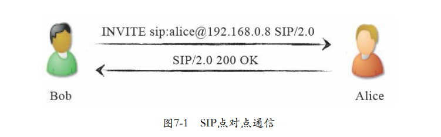
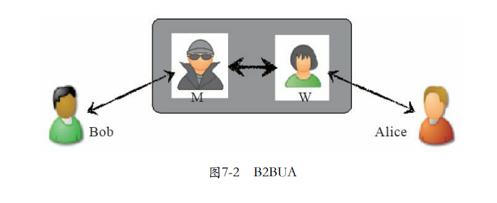
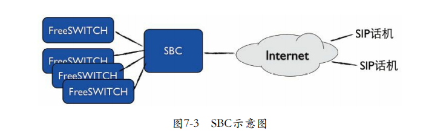
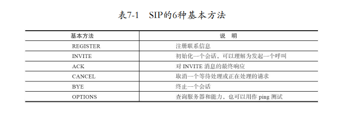
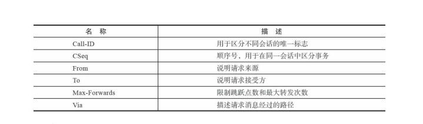
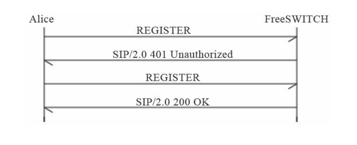
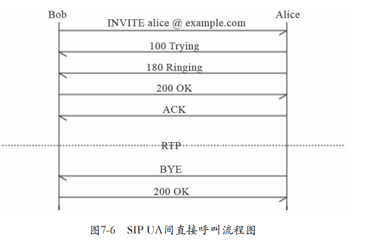
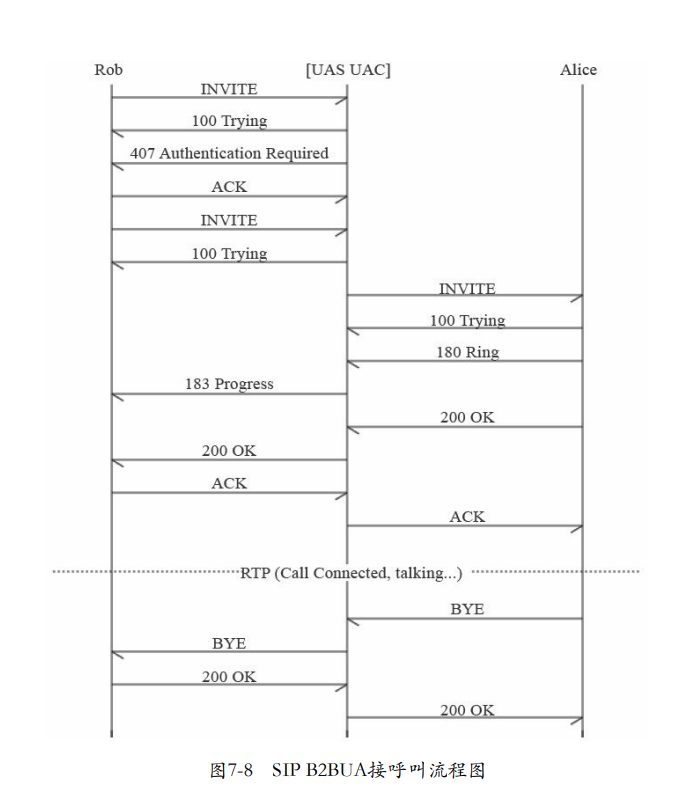
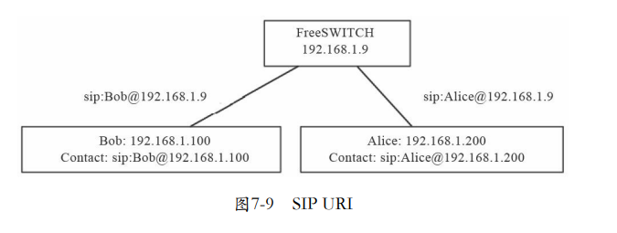

# SIP协议

## SIP协议基础
会话初始协议（`Session Initiation Protocol`）是一个控制发起、修改和终结交互式多媒体会话的信令协议。它是由`IETF`（`Internet Engineering Task Force`，Internet工程任务组）在RFC 2543中定义的，最早发布于1999年3月，后来在2002年6月又发布了一个新的标准 RFC 3261。除此之外，还有很多相关的或是在SIP基础上扩展出来的RFC，如关于SDP的RFC 4566、关于会议的RFC 4579等。

## HTTP与SIP协议基础
SIP是一个基于文本的协议，这一点与HTTP和SMTP类似。我们 来对比一组简单的HTTP请求与SIP请求。
```
HTTP: GET /index.html HTTP/1.1 
SIP:  INVITE sip:seven@freeswitch.org.cn SIP/2.0
```
两者类似，请求均有三部分组成：在`HTTP`请求中，`GET`指明一个获取资源（文件）的动作，`/index.html`则是资源的地址，最后 `HTTP/1.1`是协议版本号；而在`SIP`中，`INVITE`表示发起一次呼叫请求，`seven@freeswitch.org.cn`为请求的地址，也称为`SIP URI`或 `AOR`（`Adress of Record`，用户的公开地址），第三部分的`SIP/2.0`也是版本号。其中，`SIP URI`类似一个电子邮件地址，其格式为`“协议:名称@主机”`。这里`SIP URI`格式中的`“协议”`与`HTTP`和`HTTPS`相对应， 也有`SIP`和`SIPS`两种（后者是加密的，如`sips:seven@freeswitch.org.cn`）；“名称”可以是一串数字的电话号码，也可以是字母表示的名称；而“主机”可以是一个域名，也可以是一个`IP`地址。


```
  1 * Rebuilt URL to: localhost/
  2 * Hostname was NOT found in DNS cache
  3 *   Trying 127.0.0.1...
  4 * Connected to localhost (127.0.0.1) port 80 (#0)
  5 > GET / HTTP/1.1
  6 > User-Agent: curl/7.35.0
  7 > Host: localhost
  8 > Accept: */*
  9 >
 10 < HTTP/1.1 200 OK
 11 * Server nginx/1.4.6 (Ubuntu) is not blacklisted
 12 < Server: nginx/1.4.6 (Ubuntu)
 13 < Date: Sun, 15 Apr 2018 02:44:34 GMT
 14 < Content-Type: text/html
 15 < Content-Length: 612
 16 < Last-Modified: Tue, 04 Mar 2014 11:46:45 GMT
 17 < Connection: keep-alive
 18 < ETag: "5315bd25-264"
 19 < Accept-Ranges: bytes
 20 <
 21 <!DOCTYPE html>
 22 <html>
 23 <head>
 24 <title>Welcome to nginx!</title>
 25 <style>
 26     body {
 27         width: 35em;
 28         margin: 0 auto;
 29         font-family: Tahoma, Verdana, Arial, sans-serif;
 30     }
 31 </style>
 32 </head>
 33 <body>
 34 <h1>Welcome to nginx!</h1>
 35 <p>If you see this page, the nginx web server is successfully installed and
 36 working. Further configuration is required.</p>
 37 
 38 <p>For online documentation and support please refer to
 39 <a href="http://nginx.org/">nginx.org</a>.<br/>
 40 Commercial support is available at
 41 <a href="http://nginx.com/">nginx.com</a>.</p>
 42 
 43 <p><em>Thank you for using nginx.</em></p>
 44 </body>
 45 </html>
 46 * Connection #0 to host localhost left intact
 47 

```
以`“*”`开头的都是CURL的调试信息，以`“>”`开头的行是客户端向服务器发出的请求，以`“<”`开头的行是服务器对客户端的响应。

## SIP的基本概念和相关元素
`SIP`是一个`对等`的协议，类似`P2P`。它和`HTTP`不一样，其不是客户端服务器结构的；也不像传统电话那样必须有一个中心的交换机，它可以在不需要服务器的情况下进行通信，只要通信双方都彼此知道对方地址（或者只有一方知道另一方的地址）即可，这种情况称为`点对点通信`。如图7-1所示，Bob给Alice发送一个`INVITE`请求，说“Hi,一起吃饭吧…”，Alice说“好的，OK”，电话就接通了。



在`SIP`网络中，Alice和Bob都称为用户代理（`User Agent`，`UA`）。`UA`是在`SIP`网络中发起或响应`SIP`处理的逻辑实体。`UA`是有状态的，也就是说，它维护会话（或称对话）的状态。`UA`有两种：一种是`UAC`（`UA Client`），它是发起`SIP`请求的一方，比如图7-1中的Bob；另一种是`UAS`（`UA Server`），它是接受请求并发送响应的一方，比如图7-1中的Alice。由于`SIP`是对等的，当Alice呼叫Bob时，Alice就称为UAC，而Bob则实现UAS的功能。一般来说，UA都会实现上述两种功能。

- 代理服务器（Proxy Server）
- 重定向服务器（Redirect Server）
- 注册服务器
- 背靠背用户代理（Back-to-Back UA，B2BUA）



- 边界会话控制器（Session Border Controller，SBC）。



## SIP协议的基本方法和头域简介
### 基本方法


#### 头域


## SIP注册
通常的注册流程是，Alice向FreeSWITCH发起注册（`REGISTER`）请求，FreeSWITCH返回`401`消息对Alice发起`Challenge`（挑战），Alice将自己的用户名密码信息与收到的`Challenge`信息进行计算，并将计算结果以加密的形式附加到下一个`REGISTER`请求上，重新发起注册，FreeSWITCH收到后对本地数据库中保存的Alice的信息使用同样的算法进行计算和加密，并将其与Alice发过来的计算结果相比较。如果计算结果相匹配，则认证通过，Alice便可以正常注册。交互流程如图7-4所示。



`SIP`消息是在真正的`FreeSWITCH`中跟踪（`trace`）出来的。其中`FreeSWITCH`服务器的`IP`地址是`192.168.4.4`，它使用默认的端口号`5060`，在这里我们使用的`SIP`承载方式是`UDP`。Alice使用的UA是`Zoiper`，端口号是`5090`。其中，每个消息短横线之间的内容都是`FreeSWITCH中`输出的调试信息，不是SIP的一部分。`recv`（Receive的缩写形式）表示`FreeSWITCH`收到的消息，`send`表示发出的消息，下同。

在Alice发起注册时，下面是FreeSWITCH收到的第一条消息（为了便于说明，在排版时增加了行号）：
```
------------------------------------------------------------------------
recv 584 bytes from udp/[192.168.4.4]:5090 at 12:30:57.916812:
------------------------------------------------------------------------
01 REGISTER sip:192.168.4.4;transport=UDP SIP/2.0
02 Via: SIP/2.0/UDP 192.168.4.4:5090;branch=z9hG4bK-d8754z-d9ed3bbae47e568b-1---d8754z-;rport
03 Max-Forwards: 70
04 Contact: <sip:Alice@192.168.4.4:5090;rinstance=d42207a765c0626b;transport=UDP>
05 To: <sip:Alice@192.168.4.4;transport=UDP>
06 From: <sip:Alice@192.168.4.4;transport=UDP>;tag=9c709222
07 Call-ID: NmFjNzA3MWY1MDI3NGViMjY1N2QwZDlmZWQ5ZGY2OGE.
08 CSeq: 1 REGISTER
09 Expires: 3600
10 Allow: INVITE, ACK, CANCEL, BYE, NOTIFY, REFER, MESSAGE, OPTIONS, INFO, SUBSCRIBE
11 User-Agent: Zoiper rev.5415
12 Allow-Events: presence
13 Content-Length: 0
```
- 第1行的`REGISTER`表示这是一条注册消息。
- 第2行的`Via`是SIP的`消息路由`，如果SIP经过好多代理服务器转发，则会有多条`Via`记录。
- 第3行，`Max-forwards`指出消息最多可以经过多少次转发，主要是为了防止产生死循环。
- 第4行，`Contact`是Alice的联系地址，即相当于Alice家的地址，本例中FreeSWITCH应该能在192.168.4.4这台机器上的5090端口找到她。
- 第5和第6行的`To`和`From`表示以Alice注册。
- 第7行，`Call-ID`是本次SIP会话（Session）的标志。
- 第8行，`CSeq`是一个序号，由于UDP是不可靠的协议，在不可靠的网络上可能丢包，所以有些包需要重发，该序号则可以防止重发引起的消息重复。
- 第9行，`Expires`是说明本次注册的有效期，单位是秒。在本例中，Alice的注册信息会在一小时后失效，它应该在半小时内再次向FreeSWITCH注册，以免FreeSWITCH“忘记”她。实际上，大部分UA的实现都会在几十秒内重新发一次注册请求，这在`NAT`的网络中有助于保持连接。
- 第10行，Allow是说明Alice的`UA`所能支持的功能，某些UA功能丰富，而某些UA仅有有限的功能。
- 第11行，`User-Agent`是UA的型号。
- 第12行，`Allow-Events`说明她允许哪些事件通知。
- 第13行，`Content-Length`是消息正文（`Body`）的长度，在这里只有消息头（`Header`），没有消息正文，因此长度为0。

FreeSWITCH需要验证Alice的身份才允许她注册。在SIP中，没有发明新的认证方式，而是使用已有的`HTTP`摘要（`Digest`）方式来认证。这里它给Alice回送（发，`send`）401响应消息，消息内容如下
```
------------------------------------------------------------------------
send 664 bytes to udp/[192.168.4.4]:5090 at 12:30:57.919364:
------------------------------------------------------------------------
SIP/2.0 401 Unauthorized
Via: SIP/2.0/UDP 192.168.4.4:5090;branch=z9hG4bK-d8754z-d9ed3bbae47e568b-1---d8754z-;rport=5090
From: <sip:Alice@192.168.4.4;transport=UDP>;tag=9c709222
To: <sip:Alice@192.168.4.4;transport=UDP>;tag=QFXyg6gcByvUH
Call-ID: NmFjNzA3MWY1MDI3NGViMjY1N2QwZDlmZWQ5ZGY2OGE.
CSeq: 1 REGISTER
User-Agent: FreeSWITCH-mod_sofia/1.0.trunk-16981M
Allow: INVITE, ACK, BYE, CANCEL, OPTIONS, MESSAGE, UPDATE, INFO, REGISTER, REFER,
NOTIFY, PUBLISH, SUBSCRIBE
Supported: timer, precondition, path, replaces
WWW-Authenticate: Digest realm="192.168.4.4",
nonce="62fb812c-71d2-4a36-93d6-e0008e6a63ee",
algorithm=MD5, qop="auth"
Content-Length: 0
```

`401`消息表示未认证，它是FreeSWITCH对Alice请求的响应。各消息头的含义基本上与请求中的含义是一样的。其中，`“CSeq:1REGISTER”`表示它是针对刚刚收到的`CSeq`为1的`REGISTER`请求的响应。同时，它在本端生成一个认证摘要（`WWW-Authenticate`），一起发送给Alice。

Alice收到带有摘要的`401`后，重新发起注册请求，这一次加上了根据收到的摘要和她自己的用户名密码生成的认证信息（`Authorization`头）。同时，下面你可能也会注意到，CSeq序号变成
了2。下面是重发的注册请求信息：
```
------------------------------------------------------------------------
recv 846 bytes from udp/[192.168.4.4]:5090 at 12:30:57.921011:
------------------------------------------------------------------------
REGISTER sip:192.168.4.4;transport=UDP SIP/2.0
Via: SIP/2.0/UDP 192.168.4.4:5090;branch=z9hG4bK-d8754z-dae1693be9f8c10d-1---d8754z-;rport
Max-Forwards: 70
Contact: <sip:Alice@192.168.4.4:5090;rinstance=d42207a765c0626b;transport=UDP>
To: <sip:Alice@192.168.4.4;transport=UDP>
From: <sip:Alice@192.168.4.4;transport=UDP>;tag=9c709222
Call-ID: NmFjNzA3MWY1MDI3NGViMjY1N2QwZDlmZWQ5ZGY2OGE.
CSeq: 2 REGISTER
Expires: 3600
Allow: INVITE, ACK, CANCEL, BYE, NOTIFY, REFER, MESSAGE, OPTIONS, INFO, SUBSCRIBE
User-Agent: Zoiper rev.5415
Authorization: Digest username="Alice",realm="192.168.4.4",
nonce="62fb812c-71d2-4a36-93d6-e0008e6a63ee",
uri="sip:192.168.4.4;transport=UDP",
response="32b5ddaea8647a3becd25cb84346b1c3",
cnonce="b4c6ac7e57fc76b85df9440994e2ede8",
nc=00000001,qop=auth,algorithm=MD5
Allow-Events: presence
Content-Length: 0
```

FreeSWITCH收到带有认证的注册消息后，核实Alice身份，如果认证通过，则向Alice回应`200 OK`消息，表示注册成功了。返回的`200 OK`消息如下：
```
------------------------------------------------------------------------
send 665 bytes to udp/[192.168.4.4]:5090 at 12:30:57.936940:
------------------------------------------------------------------------
SIP/2.0 200 OK
Via: SIP/2.0/UDP 192.168.4.4:5090;branch=z9hG4bK-d8754z-dae1693be9f8c10d-1---d8754z-;rport=5090
From: <sip:Alice@192.168.4.4;transport=UDP>;tag=9c709222
To: <sip:Alice@192.168.4.4;transport=UDP>;tag=rrpQj11F86jeD
Call-ID: NmFjNzA3MWY1MDI3NGViMjY1N2QwZDlmZWQ5ZGY2OGE.
CSeq: 2 REGISTER
Contact: <sip:Alice@192.168.4.4:5090;rinstance=d42207a765c0626b;transport=UDP>; expires=3600
Date: Tue, 27 Apr 2010 12:30:57 GMT
User-Agent: FreeSWITCH-mod_sofia/1.0.trunk-16981M
Allow: INVITE, ACK, BYE, CANCEL, OPTIONS, MESSAGE, UPDATE, INFO, REGISTER, REFER,
NOTIFY, PUBLISH, SUBSCRIBE
Supported: timer, precondition, path, replaces
Content-Length: 
```

如果认证失败（可能是Alice的密码填错了），则回应`403 Forbidden`或其他失败消息，消息内容如下：
```
------------------------------------------------------------------------
send 542 bytes to udp/[192.168.4.4]:5090 at 13:22:49.195554:
------------------------------------------------------------------------
SIP/2.0 403 Forbidden
Via: SIP/2.0/UDP 192.168.4.4:5090;branch=z9hG4bK-d8754z-d447f43b66912a1b-1---d8754z-;rport=5090
From: <sip:Alice@192.168.4.4;transport=UDP>;tag=c097e17f
To: <sip:Alice@192.168.4.4;transport=UDP>;tag=yeecX364pvryj
Call-ID: ZjkxMGJmMjE4Y2ZiNjU5MzM5NDZkMTE5NzMzMzM0Mjc.
CSeq: 2 REGISTER
User-Agent: FreeSWITCH-mod_sofia/1.0.trunk-16981M
Allow: INVITE, ACK, BYE, CANCEL, OPTIONS, MESSAGE, UPDATE, INFO, REGISTER, REFER,
NOTIFY, PUBLISH, SUBSCRIBE
Supported: timer, precondition, path, replaces
Content-Length: 0
```
在整个注册过程中，Alice的密码是不会直接在SIP消息中传送的，因而最大限度地保证了认证过程的安全。

如果Alice注册成功，则FreeSWITCH会将Alice在SIP消息中的联系地址（`Contact`字段）记录下来。以后如果有人呼叫Alice，FreeSWITCH就可以向该联系地址发送SIP消息以建立呼叫。

## SIP呼叫流程
SIP UA向FreeSWITCH注册的主要是为了在呼叫时FreeSWITCH能够找到它。SIP的主要意义也是**处理会话的发起和终结**，通俗地讲就是处理和控制呼叫。
### UA间直接呼叫



### SIP B2BUA接呼叫



## 深入理解SIP
### SIP URI

Alice注册到FreeSWITCH，Bob呼叫她时，使用她的服务器地址（因为Bob只知道服务器地址），即`sip:Alice@192.168.1.9`，FreeSWITCH接到请求后，查找本地数据库，发现Alice的实际地址（`Contact`地址，又叫`联系`地址）是sip:Alice@192.168.1.200，便可以建立呼叫。

SIP URI除使用IP地址外，也可以使用域名，如`sip:Alice@freeswitch.org.cn`。更高级及更复杂的配置可能需要DNS的SRV记录。

### SDP和SOA
SIP负责建立和释放会话，一般来说，会话会包含相关的媒体，如视频和音频。媒体数据是由SDP（`Session Description Protocol`，会话描述协议）描述的。SDP一般不单独使用，它与SIP配合使用时会放到SIP协议的正文（Body）中。会话建立时，需要媒体协商，双方才能确定对方的媒体能力以交
换媒体数据。

- v=：Version·，表示协议的版本号。
- o=：Origin，表示源。值域中各项（以空格分隔）的涵义依次是username（用户名）、sess-id（会话ID）、sess-version（会话版本号）、nettype（网络类型）、addrtype（地址类型）、unicastaddress（单播地址）。
- s=：Session Name，表示本SDP所描述的Session的名称。
- c=：Connecton Data，连接数据。其中值域中以空格分配的两个字段分别是网络类型和网络地址，以后的RTP流就会发到该地址上。
- b=：Badwidth Type，带宽类型。
- t=：Timing，起止时间。0表示无限。
- m=：audio Media Type，媒体类型。audio表示音频，50452表示音频的端口号，跟图7-10中的一致；RTP/AVP是传输协议；后面是支持的Codec类型，与RTP流中的Payload Type（载荷类型）相对应，在这里分别是8、0、98和101，8和0分别代表PCMA和PCMU，它
们属于静态编码，因而有一一对应的关系，而对于大于95的编码都属
于动态编码，需要在后面使用“a=rtpmap”进行说明。
- a=：Attributes，属性。它用于描述上面音频的属性，如本例中98代表8000Hz的ILBC编码，101代表RFC2833 DTMF事件。a=sendrecv表示该媒体流可用于收和发，其他的还有sendonly（仅收）、
recvonly（仅发）和inactive（不收不发）。
- v=：Video，视频。而且与H264的视频编码对应的也是一个动态的Payload Type