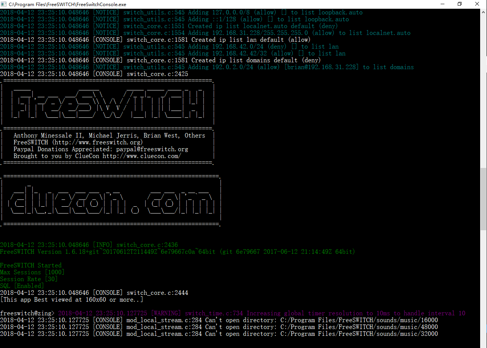
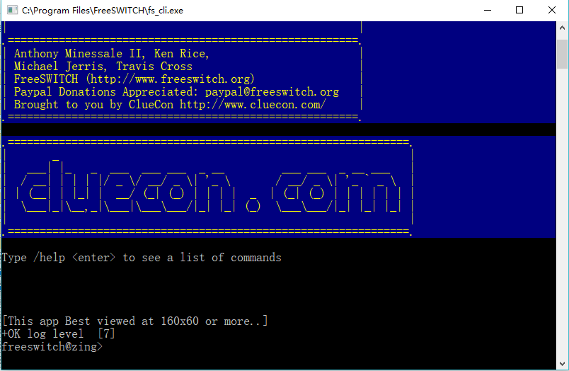
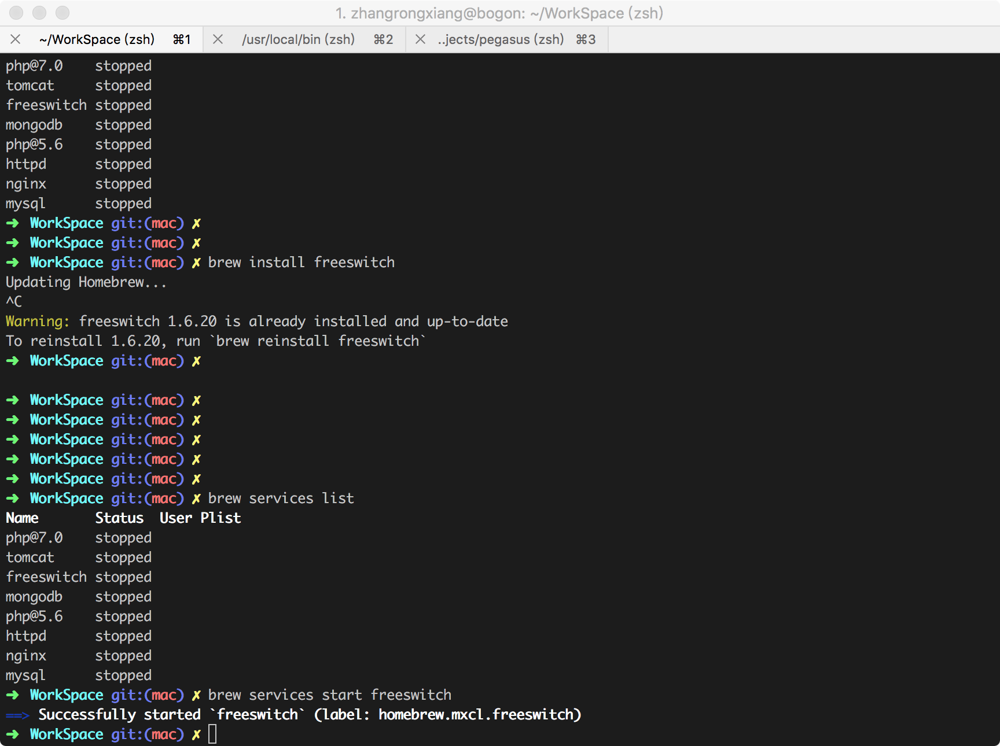
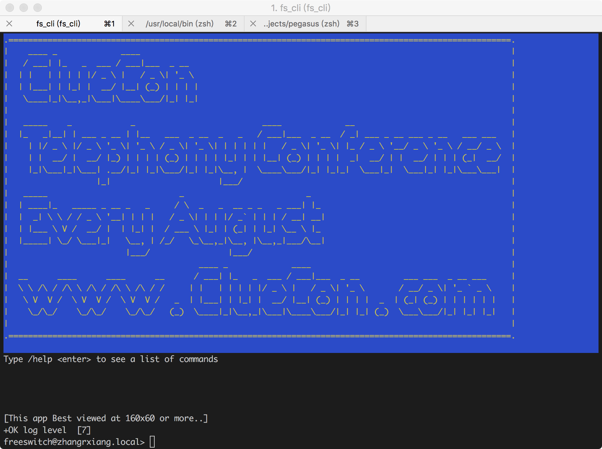
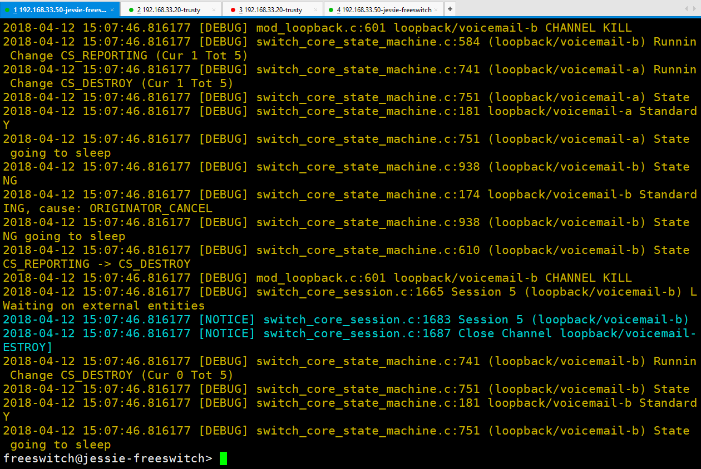

# Install

## Windows
### download page
- <http://files.freeswitch.org/windows/installer/>
- 64位 <http://files.freeswitch.org/windows/installer/x64/>
- 32位 <http://files.freeswitch.org/windows/installer/x86/>

### install
- 下载对应版本
- 默认安装目录 `C:\Program Files\FreeSWITCH`

## run
- 以管理员权限运行freeswitch命令 `FreeSwitchConsole.exe`
> 
- 客户端 `fs_cli.exe`
> 
**显示安装成功**

## Mac
### install
`brew install freeswitch`


## run 
- 服务端  `brew services start freeswitch`
- 客户端  `fs_cli`


## Linux
### debin-jessie
#### install
```php
wget -O - https://files.freeswitch.org/repo/deb/debian/freeswitch_archive_g0.pub | apt-key add -
echo "deb http://files.freeswitch.org/repo/deb/freeswitch-1.6/ jessie main" > /etc/apt/sources.list.d/freeswitch.list

apt-get update && apt-get install -y freeswitch-meta-all

```
#### run 
- 服务端  `sudo systemctl start freeswitch.service`
- 客户端  `fs_cli`
